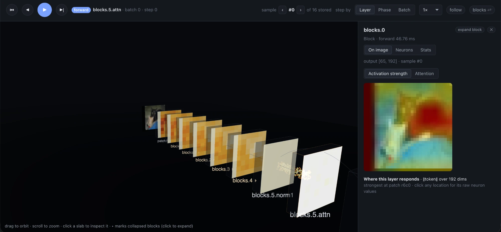
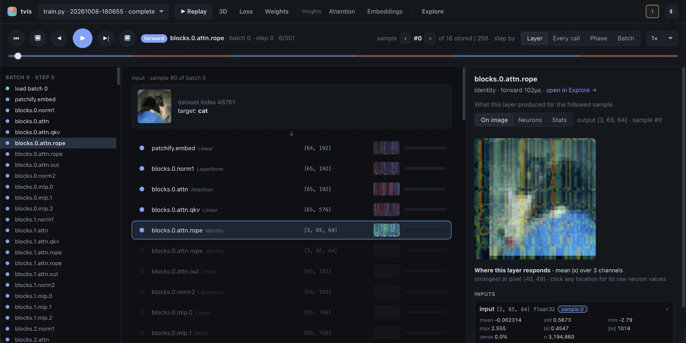

<p align="center">
  
</p>

# tvis

A step-through debugger for PyTorch training.

Run your **unmodified** training script under `tvis run`. It records the first few optimizer steps
end to end, then exits:

- the raw image file or text string, every transform and the tokenizer, and the collated batch
- every `nn.Module` and every function in your project, in call order, linked to the source line
- the inputs and outputs of each call, with shape, dtype, statistics, histogram and full values
- the gradient dL/d(tensor) of every captured activation
- the shape produced by each line inside your functions
- the output decoded into class names, or into text with the tokenizer
- per-sample loss
- the parameter update of every weight (‖Δw‖/‖w‖)
- forward and backward time per call, measured on the GPU with CUDA events, with tvis's own
  overhead removed

Then open the recording in your browser, on your laptop, even when training ran on a cluster two
SSH hops away.

```bash
python train.py --lr 3e-4                       # normal training: tvis is never imported
tvis run --steps 3 train.py --lr 3e-4           # debug run: same script, same arguments
tvis open mycluster:~/proj/tvis_runs            # on your laptop: opens the viewer
```





> Early development (v1). PyTorch, single device, eager mode. See [SCOPE.md](SCOPE.md).

## Install

```bash
pip install -e .        # in the training environment (needs torch) and on your laptop (no torch needed)
```

## Recording a run

```bash
tvis run [--steps N] [--out DIR] [--project DIR] train.py [script args...]
```

- The script runs in-process exactly as `python train.py ...` would (`__main__`, `sys.argv`,
  imports). After `N` optimizer steps (default 3), tvis saves the recording and stops the script.
- Runs are written to `<project>/tvis_runs/<timestamp>_<script>_<id>/`. The project directory
  defaults to the script's directory. Functions defined under it are traced; library code is not.
- DataLoader workers are moved into the main process during `tvis run` so the data pipeline is
  observable. The run reports this as a notice.
- With gradient accumulation, a step contains several batches. A script without `torch.optim`
  treats each backward as a step.
- Exit codes are passed through. If the script crashes, everything recorded before the crash is
  kept, and the run is marked as failed with the traceback.

On SLURM, change one line in your job script:

```bash
srun tvis run --steps 3 train.py --lr 3e-4      # was: srun python train.py --lr 3e-4
```

When it finishes, `tvis run` prints the command for viewing the recording from your laptop.

## Viewing runs

`tvis open` starts the viewer on `127.0.0.1` on your laptop and opens your browser.

```bash
tvis open ./tvis_runs                           # runs on this machine
tvis open gpu-login:~/proj/tvis_runs            # any ssh host or ~/.ssh/config alias
tvis open --via bastion --via login c42:/scratch/me/tvis_runs    # explicit jump hosts
```

For remote runs, tvis runs `ssh <host> tvis agent --stdio` and reads the run over that SSH
session's stdin/stdout. No port is opened on the cluster, so it works where port forwarding is
disabled. Only the data you look at is transferred. Hops come from your `~/.ssh/config`
(`ProxyJump`) or from `--via`. tvis reuses SSH connections, so on clusters with 2FA you're asked
to authenticate at most once.

If `tvis` isn't on the remote `PATH` for non-interactive shells (common with conda or venvs), tell
it how to start:

```bash
tvis open gpu:~/proj/tvis_runs --remote-tvis "~/miniconda3/envs/train/bin/tvis"
```

Save a target you use often:

```bash
tvis target add gpu --host c42 --via bastion,login --path ~/proj/tvis_runs --remote-tvis ~/venv/bin/tvis
tvis open gpu
```

## The viewer

Pages run left to right in the order a training step happens, and keys `1`–`5` jump between
them (`?` lists every shortcut). Colour always means a training phase or a value, never decoration:
data · forward · loss · backward · update.

| Page | What it shows |
|---|---|
| **Replay** (default) | Plays the recorded steps back like training happening. The batch loads and your sample goes through the transforms; each layer lights up with its activation for that sample; the loss appears; gradients flow back up, each layer coloured by ‖dL/d(output)‖; the optimizer updates; the next batch starts. Play/pause, step (←/→), jump by phase, pick the step size (layer · every call · phase · batch) and the sample (`[` / `]`). The bar under the controls maps the whole recording (one block per batch, its phases inside): click or drag to jump; *Data → Forward → Loss → Backward → Update* shows where you are and jumps to any phase. Switch between the **Layer stack** and **3D** views at the same moment. |
| **Every layer: On image · Neurons · Stats** | In Replay and in Trace's inspector. *On image*: the layer's activation (or gradient) for the followed sample painted over the input picture: mean \|x\| per location for conv maps, per-patch token strength for ViTs, and for attention layers where `[CLS]` (or any patch you click) looks. Click a location for every neuron's raw value there. *Neurons*: every conv channel / ViT hidden dimension as its own map (most active first) or, for vectors such as logits, labelled bars; click one for its exact numbers. |
| **Loss** | Loss per batch across the run. The exact loss call and how it reduces. Each sample's p(target) → −log p → loss, worst first. A confusion matrix over all captured samples (classification), or each target token coloured by its loss with padding struck out (language models). |
| **Weights** | One layer at a time: conv kernels as a filter × channel grid, matrices as heatmaps, with stats and histograms. Switch weight / gradient / update Δw and slide across steps. "All layers" shows lazily loaded thumbnails of every parameter. |
| **Insights → Attention** | Token-to-token attention maps from softmax weights computed in your code, per layer and head with real tokens on the axes, plus attention rollout across layers. |
| **Insights → Grad-CAM** | True Grad-CAM (class-score gradients) over each input image, per conv layer, for the predicted or the true class. |
| **Insights → Embeddings** | PCA of every captured sample's representation at a chosen layer, coloured by class (slide through depth to see classes separate), and PCA of embedding tables labelled by token. |
| **Trace** | The full debugger: call tree, inspector, samples, timeline, annotated source, layers table, step view. |

Insights views appear only when they apply: Grad-CAM needs conv layers, Attention needs attention
softmaxes, and so on.

## Accuracy

- **Observing never changes training.** Losses and parameters are bit-identical with and without
  `tvis run`. The test suite checks this in-process and across processes.
- **Gradients are the real ones.** Captured activation gradients equal autograd's, and parameter
  updates match `p_after - p_before` exactly.
- **Timing excludes tvis.** Forward times and timeline positions have tvis's own capture work
  subtracted. On CUDA they are device times (CUDA events), not Python wall time.
- **Grad-CAM doesn't disturb training.** It uses an extra `autograd.grad` pass that never writes
  `.grad`, and tvis's gradient hooks are paused during it. Disable it with `--no-gradcam`.
- **Approximations are labelled.**
  - Backward time per call is inferred from when gradients arrive.
  - The batch dimension of merged tensors such as `[B*T, V]` is inferred.
  - Layers that mix samples (BatchNorm in training mode) are flagged in per-sample views.

## Limitations (v1)

- One process, one device. No DDP, FSDP or `torchrun` yet.
- `torch.compile`d modules may hide their internals from the hooks.
- With AMP `GradScaler`, recorded gradients are the scaled gradients.
- Tensors above `--max-elems` (default 2M elements) keep stats and their leading rows only.
- Image and text decoding support: torchvision transforms (v1/v2), PIL, HuggingFace tokenizers.
- Attention maps need the softmax to be computed in your project's code. Fused kernels
  (`F.scaled_dot_product_attention`) and attention inside libraries never expose their weights.
- During the Grad-CAM pass, gradient hooks *you* registered on activations also fire once more.

## Development

See [AGENTS.md](AGENTS.md) for commands, layout, invariants and test conventions.

```bash
python -m venv .venv && .venv/bin/pip install -e ".[dev]"
.venv/bin/pytest -q
```
